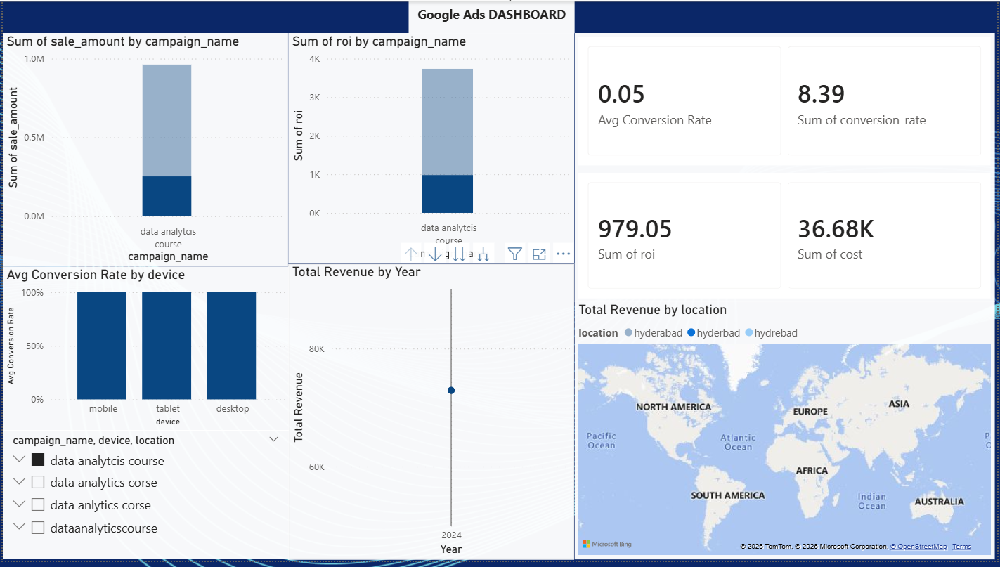

# Ist-DA-Project-Google-Ads-Analytics-Dashboard-
End-to-end Google Ads data analysis using Google Colab and Power BI

# Google Ads Analytics Dashboard (Power BI)

## Overview
This project presents an end-to-end data analytics solution using Google Ads campaign data. The workflow includes data cleaning, SQL analysis, Python EDA, and an interactive Power BI dashboard.

## Tools & Technologies
- Power BI Desktop
- Google Colab

## Dashboard Preview

## Key Insights
- Desktop devices show higher conversion rates compared to mobile and tablet.
- Certain campaigns generate high revenue but lower ROI, indicating inefficient spending.
- Revenue contribution varies significantly across locations.
- Some high-cost ads do not deliver proportional returns and require optimization.

## Files Included
- `DA Project.pbix` – Power BI dashboard file
- `GoogleAds_Cleaned.csv` – Cleaned dataset
- `Dashboard.png` – Dashboard snapshot
- `README.md` – Project documentation

## How to Use
1. Download the `.pbix` file
2. Open using Power BI Desktop
3. Explore visuals using filters and slicers
